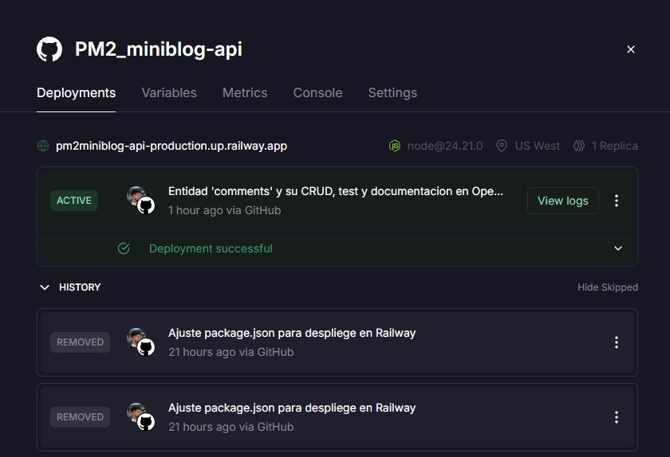
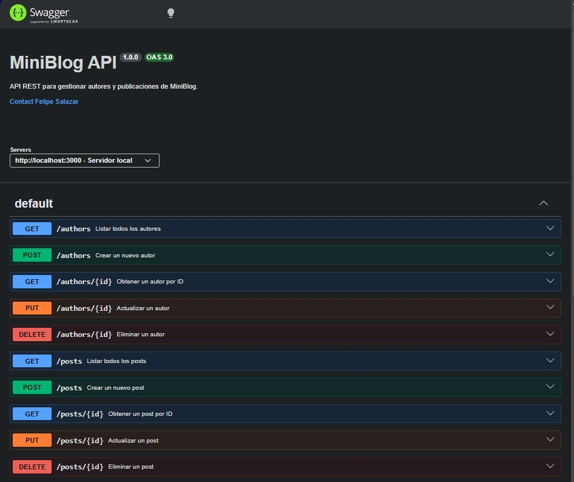
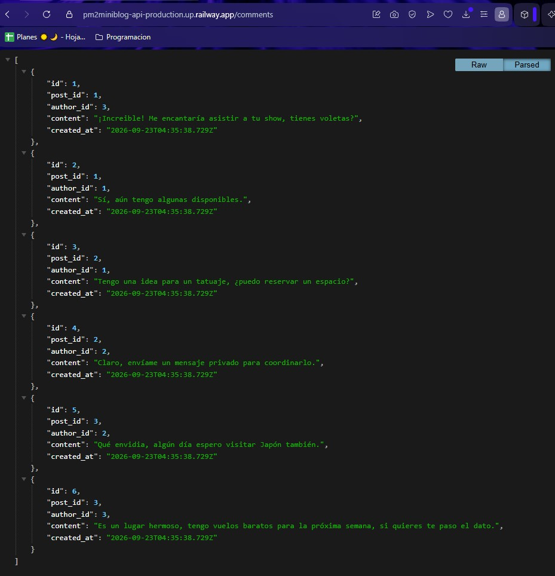

# MiniBlog API

API REST desarrollada en Node.js + Express, conectada a PostgreSQL, para gestionar autores (`authors`), publicaciones (`posts`) y comentarios (`comments`) de un blog. Proyecto de práctica enfocado en conexión Express–Postgres, operaciones CRUD, validación, testing y despliegue.

🔗 **API desplegada:** https://pm2miniblog-api-production.up.railway.app

📖 **Documentación interactiva:** https://pm2miniblog-api-production.up.railway.app/docs

---

## 📋 Descripción del proyecto

La API expone endpoints CRUD para tres entidades relacionadas:

- **authors**: `id`, `name`, `email` (único), `bio`, `created_at`.
- **posts**: `id`, `author_id` (FK → `authors.id`), `title`, `content`, `published`, `created_at`.
- **comments**: `id`, `post_id` (FK → `posts.id`), `author_id` (FK → `authors.id`), `content`, `created_at`.

Un autor puede tener muchos posts, y un post puede tener muchos comentarios. Al eliminar un autor, sus posts y comentarios se eliminan automáticamente (`ON DELETE CASCADE`); lo mismo ocurre con los comentarios de un post al eliminar ese post.

### Stack

- **Node.js** + **Express 5** (ES Modules)
- **PostgreSQL** (consultas parametrizadas con `pg`, sin ORM)
- **Vitest** + **supertest** para tests
- **Swagger UI** para documentación interactiva
- Desplegado en **Railway**

---

## ⚙️ Requisitos

- [Node.js](https://nodejs.org/) v18 o superior
- [PostgreSQL](https://www.postgresql.org/) instalado y corriendo localmente (o acceso a una instancia remota)
- npm (viene incluido con Node.js)

---

## 🚀 Ejecutar en local

### 1. Clonar el repositorio

```bash
git clone https://github.com/Felipe-Salazar/PM2_miniblog-api.git
cd PM2_miniblog-api
```

### 2. Instalar dependencias

```bash
npm install
```

### 3. Crear la base de datos

En PostgreSQL (con `psql` o pgAdmin), crea una base de datos vacía:

```sql
CREATE DATABASE miniblog;
```

### 4. Ejecutar los scripts SQL

Con pgAdmin (Query Tool) o `psql`, ejecuta en orden:

```bash
psql -U postgres -d miniblog -f sql/setup.sql
psql -U postgres -d miniblog -f sql/seed.sql
```

`setup.sql` crea las tablas (`authors`, `posts`) con sus relaciones e índices. `seed.sql` inserta datos de ejemplo para probar la API de inmediato.

### 5. Configurar variables de entorno

Copia `.env.example` a un nuevo archivo `.env` en la raíz del proyecto:

```bash
cp .env.example .env
```

Y completa los valores según tu instalación local:

```
DB_USER=postgres
DB_HOST=localhost
DB_NAME=miniblog
DB_PASSWORD=tu_contraseña
DB_PORT=5432
PORT=3000
```

> ⚠️ `.env` nunca se sube a GitHub (está en `.gitignore`). Solo `.env.example` (sin valores reales) se versiona.

### 6. Levantar el servidor

```bash
npm run dev
```

El servidor queda disponible en `http://localhost:3000`.

---

## 🧪 Ejecutar los tests

```bash
npm test
```

Corre la suite completa con Vitest + supertest (tests de `authors`, `posts` y `comments`: casos exitosos, validaciones y errores 400/404).

---

## 📖 Documentación OpenAPI

La documentación interactiva (Swagger UI) está disponible corriendo el servidor y visitando:

```
http://localhost:3000/docs
```

Desde ahí se pueden ver y probar todos los endpoints directamente en el navegador. La especificación en bruto está en [`openapi.yaml`](./openapi.yaml).

---

## 🌐 Endpoints principales

| Método | Ruta                      | Descripción                                           |
| ------ | ------------------------- | ----------------------------------------------------- |
| GET    | `/authors`                | Listar autores                                        |
| GET    | `/authors/:id`            | Detalle de un autor                                   |
| POST   | `/authors`                | Crear autor                                           |
| PUT    | `/authors/:id`            | Actualizar autor                                      |
| DELETE | `/authors/:id`            | Eliminar autor (y sus posts, en cascada)              |
| GET    | `/posts`                  | Listar posts                                          |
| GET    | `/posts/:id`              | Detalle de un post                                    |
| GET    | `/posts/author/:authorId` | Posts de un autor, con datos del autor incluidos      |
| POST   | `/posts`                  | Crear post                                            |
| PUT    | `/posts/:id`              | Actualizar post                                       |
| DELETE | `/posts/:id`              | Eliminar post                                         |
| GET    | `/comments`               | Listar comentarios                                    |
| GET    | `/comments/post/:postId`  | Comentarios de un post, con nombre del autor incluido |
| POST   | `/comments`               | Crear comentario                                      |
| PUT    | `/comments/:id`           | Actualizar el contenido de un comentario              |
| DELETE | `/comments/:id`           | Eliminar comentario                                   |

Detalles completos de request/response en `/docs`.

---

## ☁️ Despliegue en Railway

**URL pública:** https://pm2miniblog-api-production.up.railway.app
**Documentación en producción:** https://pm2miniblog-api-production.up.railway.app/docs

### Pasos seguidos para el despliegue

1. Crear un nuevo proyecto en [Railway](https://railway.app) y conectarlo a este repositorio de GitHub (deploy automático desde la rama `main`).
2. Agregar un servicio de **PostgreSQL** desde el catálogo de Railway, en el mismo proyecto — esto genera automáticamente sus propias variables (`DATABASE_URL`, `PGHOST`, `PGPORT`, etc.).
3. En el servicio de la API, agregar las variables de entorno:
   - `DATABASE_URL` → como **variable reference** al `DATABASE_URL` del servicio Postgres (`${{Postgres.DATABASE_URL}}`), no como valor fijo.
   - `PORT` → `3000`.
4. Ajustar `package.json`: `"main": "server.js"` y agregar el script `"start": "node server.js"` (Railway ejecuta `npm start` por defecto).
5. `src/db/pool.js` detecta automáticamente si existe `DATABASE_URL` (Railway) o usa las variables sueltas `DB_*` (entorno local) — mismo código, dos entornos.
6. Ejecutar `sql/setup.sql` y `sql/seed.sql` contra la base de datos de Railway. Para esto, se activó temporalmente el **acceso público** de Postgres (pestaña Settings → Networking → Public Networking) y se conectó pgAdmin usando `DATABASE_PUBLIC_URL` como un servidor adicional, ejecutando ambos scripts desde el Query Tool.
7. Cada `git push` a `main` dispara un nuevo deployment automático en Railway.

### Variables de entorno usadas en Railway

| Variable       | Valor                                                          |
| -------------- | -------------------------------------------------------------- |
| `DATABASE_URL` | Referencia al servicio Postgres (`${{Postgres.DATABASE_URL}}`) |
| `PORT`         | `3000`                                                         |

### Capturas del deploy

- Deployment exitoso en Railway (servicio activo, historial de despliegues).



- Documentación Swagger funcionando en producción.



- Endpoint `/comments` respondiendo con datos reales desde la URL pública.



---

## 🤖 Registro del uso de IA en el proyecto

Este proyecto fue desarrollado con la asistencia de **Claude (Anthropic)** como apoyo de aprendizaje, dado que es un proyecto educativo para practicar backend. El uso incluyó:

- Explicación de conceptos (Express, pool de conexiones, consultas parametrizadas, JOINs, claves foráneas y borrado en cascada, ES Modules, testing con Vitest/supertest, OpenAPI).
- Guía en la configuración del entorno (Node.js, PostgreSQL, Git/GitHub) y en el despliegue en Railway (variables de entorno, conexión pública temporal para correr los scripts SQL en producción).
- Revisión y corrección de código escrito por el desarrollador, con explicación de cada error encontrado (incluyendo errores de configuración entre CommonJS/ES Modules y de despliegue).
- Sugerencias de estructura de proyecto (separación en `routes`/`services`/`db`) y buenas prácticas (variables de entorno, `.gitignore`, códigos HTTP, manejo de errores, consultas parametrizadas).

Todo el código fue escrito, ejecutado y probado directamente por el desarrollador; Claude no tuvo acceso al entorno de ejecución ni a la base de datos.

---

## 📁 Estructura del proyecto

```
miniblog-api/
├── src/
│   ├── db/
│   │   └── pool.js
│   ├── routes/
│   │   ├── authors.js
│   │   ├── posts.js
│   │   └── comments.js
│   ├── services/
│   │   ├── authorsService.js
│   │   ├── postsService.js
│   │   └── commentsService.js
│   └── app.js
├── sql/
│   ├── setup.sql
│   └── seed.sql
├── tests/
│   ├── authors.test.js
│   ├── posts.test.js
│   └── comments.test.js
├── openapi.yaml
├── .env.example
├── .gitignore
├── package.json
├── vitest.config.js
└── server.js
```
